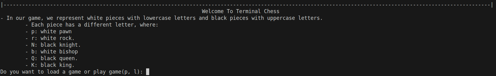
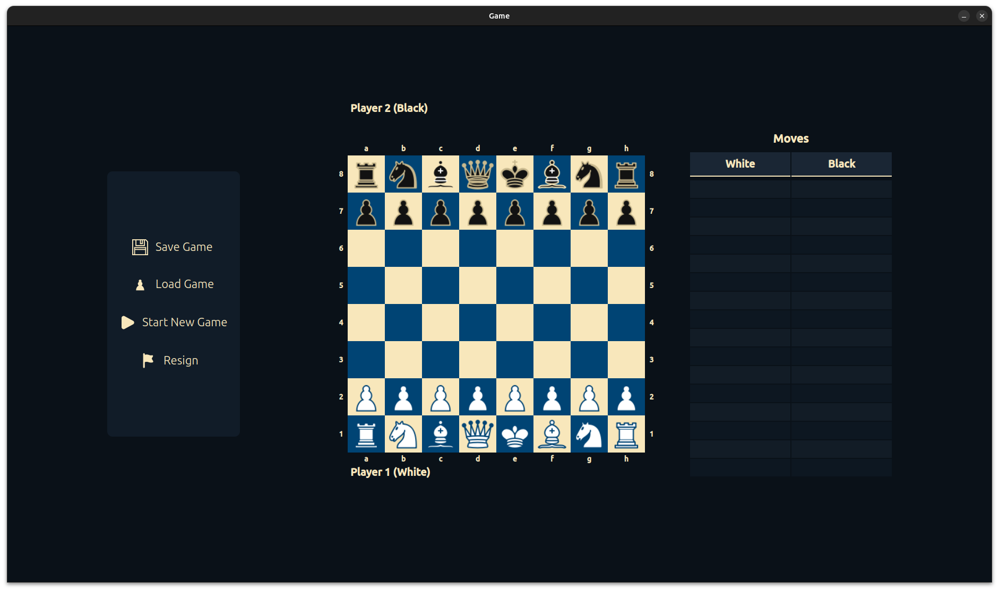
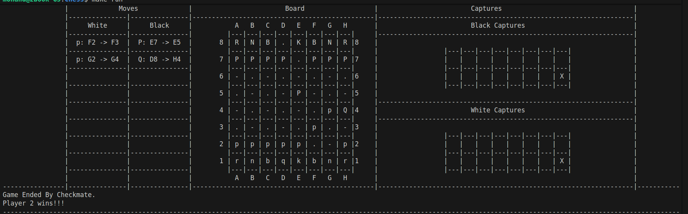

# Terminal Chess Engine Technical Report

## Table of Contents

1. [Overview](https://www.google.com/search?q=%231-overview)
2. [Technical Features](https://www.google.com/search?q=%232-technical-features)
3. [Build System](https://www.google.com/search?q=%233-build-system)
4. [Movement Logic](https://www.google.com/search?q=%234-movement-logic)
5. [Game End States](https://www.google.com/search?q=%235-game-end-states)
6. [Persistence](https://www.google.com/search?q=%236-persistence)
7. [User Manual](https://www.google.com/search?q=%237-user-manual)
8. [Snapshots](https://www.google.com/search?q=%238-snapshots)
9. [Project Contributors & Supervision](https://www.google.com/search?q=%239-project-contributors--supervision)
10. [References](https://www.google.com/search?q=%2310-references)

---

## 1. Overview

The **Terminal Chess Engine** is a comprehensive board game application implemented in C. It translates the high-level complexity of Chess into a modular, command-line interface. The engine supports full FIDE rules, including specialized movements like castling, en passant, and pawn promotion.

Key technical highlights include a recursive-style move validation system, binary file persistence for saving and loading game states, and a robust "Undo" feature that uses file truncation to safely revert moves back to the starting position.

---

## 2. Technical Features & Data Structures

### 2.1 Piece Architecture

To maintain a high level of abstraction, each chess piece is represented by a `struct`. This allows the movement logic to treat different pieces through a unified interface.

```c
typedef struct
{
    char symbol;      // e.g., 'p', 'r', 'N'
    PieceColor color; // Enum for WHITE or BLACK
    int rowPosition; 
    int colPosition;
    bool isActive;    // Tracks if the piece is still on the board
    bool isPinned;    // Flag used by Check-detection
} Piece;

```

#### Specialized Pieces

Certain pieces require state-tracking beyond the base structure:

* **Pawn Piece**: Includes promoted (to handle movement changes) and firstMove (to allow the initial 2-square jump and En Passant logic).
* **King Piece**: Includes isChecked for UI alerts and firstMove to validate castling rights.

### 2.2 Player Management

The `Player` structure acts as a container for all 16 pieces belonging to a user, utilizing dynamic memory allocation to manage the piece arrays.

```c
typedef struct
{
    const PieceColor color;
    Pawn *pawns;
    Rook *rooks;
    Knight *knights;
    Bishop *bishops;
    Queen *queen;
    King *king;
} Player;

```

### 2.3 The Chessboard

* The board is represented as a dynamic 2D char array of size . Visual Styling: White squares are rendered using "-" and black squares using ".".
* **Updating**: The addPiece function serves as the primary interface for updating the board array based on the current state of the Player structures.
* **UI/UX**: The displayBoard function handles the complex task of centered rendering. It utilizes terminal escape codes to clear the screen, providing a seamless "animation-like" feel. The interface is split into three zones: the Move Log (left), the Active Board (center), and Captured Pieces (right).

---

## 3. The Build System (Makefile)

The project uses a modular `Makefile` to manage compilation. In addition to the primary game targets, several internal targets exist to test specific logic modules (Pieces, Board, Moves, etc.) independently during development.

> **Note:** Targets marked as *Internal/Testing* were used during intermediate development phases. Some may require specific directory structures or mock data to execute correctly and may not be as stable as the primary `run` target.

| Target | Command | Category | Purpose |
| --- | --- | --- | --- |
| **run** | `make run` | **Primary** | Compiles all modules and launches the full Chess game. |
| **compile** | `make compile` | **Primary** | Links all source files and generates the `run.o` executable. |
| **clean** | `make clean` | **Utility** | Wipes all binaries in subdirectories and the root, then clears the terminal. |
| **game_end** | `make game_end` | Internal | Builds the test suite for Checkmate and Stalemate detection logic. |
| **moves** | `make moves` | Internal | Compiles move-generation and validation logic for unit testing. |
| **board** | `make board` | Internal | Compiles board rendering and coordinate mapping modules. |
| **pieces** | `make pieces` | Internal | Tests individual piece behavior and structure initialization. |
| **test_[module]** | `make test_board` etc. | Testing | Automated targets that compile *and* execute the corresponding internal test binaries. |

---

## 4. Movement Logic

### 3.1 Pawn Movement & Promotion

* The movePawn function is the most complex movement module.
* It validates:
* Forward Steps: 1-square or 2-square jumps (only on firstMove).
* Diagonal Captures: Only valid if an opponent occupies the target square.
* Promotion: Triggered when a pawn reaches the terminal ranks (Row 0 or 7).
* The checkPromotedPawn helper ensures that once a pawn is promoted to a Queen or Rook, it adopts the movement logic of that new piece type.


### 3.2 Sliding Pieces (Rook, Bishop, Queen)

* These pieces use Ray-Casting logic. The functions check every square along a chosen vector (orthogonal for Rooks, diagonal for Bishops). If any piece — friendly or enemy — is encountered before the destination, the move is flagged as invalid.

### 3.3 The Knight's Leap

* Unlike sliding pieces, the Knight ignores intervening units. The logic strictly validates the 2 x 1 or 1 x 2 coordinate displacement.

### 3.4 King Safety & Castling

* The moveKing function integrates with isChecked.
* **Castling**: Validates that neither the King nor the chosen Rook has moved, and crucially, ensures the King does not pass through "check" during the transition.
* **Check Detection**: The isChecked function performs an "inverse scan" from the King's position to see if any enemy piece has a line of sight to the King.


---

## 5. Game End States

* **Stalemate**: occurs when a player has no legal moves but is not in check. The engine detects this by simulating every possible move for every active piece using copyBoard and copyPlayer. If none of these simulated moves result in a state where the King is safe, and the King wasn't in check to begin with, a draw is declared. `copyBoard` is used to simulate every possible move to validate this state.
* **Checkmate**: is confirmed using the legalMove helper. If the King is currently under attack (isChecked == true) and all simulated escape moves, blocks, or captures still leave the King in check, the game ends and the winner is announced.

---

## 6. Persistence: Save, Load, and Undo

To ensure games can be resumed, every validated move is appended to a binary file. This is more space-efficient than a text file and prevents user tampering.

* **Save**: Commits the Move struct to disk immediately after a successful turn.
* **Load**: Reads the move history sequentially. By replaying the moves on a fresh board, the engine reconstructs the game state perfectly.
* **Undo**: This is implemented by truncating the last `sizeof(Move)` bytes from the binary file and then triggering a "Reload." This allows the player to revert their state all the way back to the opening move.

---

## 7. User Manual

* **Start**: Enter `p` to play a new game or `l` to load a game.
* **Movement**: Enter moves as `[Piece][Source][Destination]` (e.g., `pe2e4`).
* **Undo**: Type `u` to revert the last turn.
* **Save**: Type `s` to save progress and exit the application.
* **Promotion**: You will be prompted to enter `q`, `r`, `b`, or `n`.

**Note**: Most of the game's logic is case-insensitive, where you can input upper or lower case characters; it will not make a difference.

---

## 8. Snapshots of the Game

1. **Main Menu Interface**

2. **Active Gameplay with Board Rendering**

3. **End of Game: Checkmate State**


---

## 9. Project Contributors & Supervision

### Contributors

This project was developed by the following students from Alexandria University:

* **Mohand Sherief Mohamed Ali** (ID: 24010758)
* **Moaz Gaballah Ahmed** (ID: 24010732)

### Supervision

* **Prof. Dr. Marwan Torki**
* **Eng. Karim Alaa**

---

## 10. References

* **C memcpy Documentation**: [GeeksforGeeks](https://www.geeksforgeeks.org/cpp/memcpy-in-cc/)
* **Clear Console in C**: [GeeksforGeeks](https://www.geeksforgeeks.org/c/clear-console-c-language/)
* **C File I/O (Binary)**: [Programiz](https://www.programiz.com/c-programming/c-file-input-output)

**Note**: Anything that has been used in the implementation of this project was either found in the course material or inquired about in person.

---

**Alexandria University, Faculty of Engineering** **CS221: Computer Programming 1** © 2025 Terminal Chess Engine Project