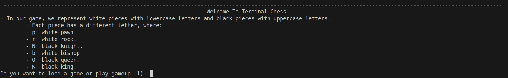
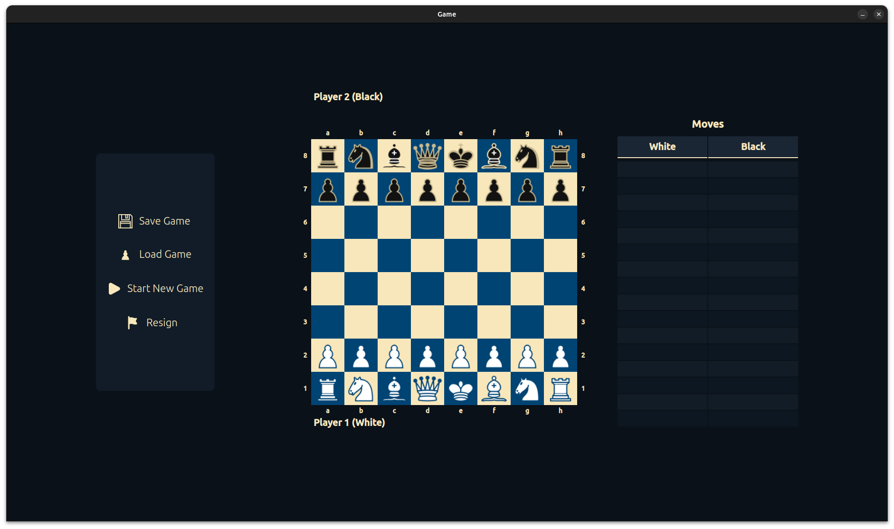
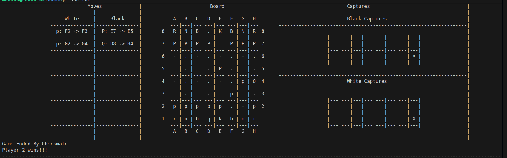

Chess Engine
======================================

Table of Contents
-----------------

* [1. Overview](#overview)
* [2. Technical Features & Data Structures](#technical)
* [3. The Build System](#the-build-system)
* [4. System Design](#system-design)
* [5. Movement Logic](#movement-logic)
* [6. Game End States](#game-end-states)
* [7. Minimax Algorithm](#minimax-algorithm)
* [8. Persistence: Save, Load, and Undo](#persistence)
* [9. User Manual](#user-manual)
* [10. Snapshots of the Game](#snapshots)
* [11. References](#references)

1. Overview
------------

The **Terminal Chess Engine** is a comprehensive board game application implemented in C and C++. It translates the high-level complexity of Chess into a modular, command-line interface. The engine supports full rules, including specialized movements like castling, en passant, and pawn promotion.

Key technical highlights include a recursive-style move validation system, binary file persistence for saving and loading game states, and a robust "Undo" feature that uses file truncation to safely revert moves back to the starting position.

The main game logic involves asking the user whether they want to play a new game or load an old one, then it gives the turn for the white player and keeps alternating the turns between black and white until checkmate, stalemate, or the user chooses to save and end the game.

2. Technical Features & Data Structures
----------------------------------------

### 2.1 Piece Architecture

To maintain a high level of abstraction, each chess piece is represented by its own `struct`. This allows the movement logic to treat different pieces through a different interface. However, in some functions a unified struct would be better, so the following struct was created as a base struct that all pieces follow, except specialized pieces:

    typedef struct
    {
        char symbol;      // e.g., 'p', 'r', 'N'
        PieceColor color; // Enum for WHITE or BLACK
        int rowPosition; 
        int colPosition;
        bool isActive;    // Tracks if the piece is still on the board
        bool isPinned;    // Flag used by Check-detection
    } Piece;

#### Specialized Pieces

Certain pieces require state-tracking beyond the base structure:

* **Pawn Piece**: Includes promoted (to handle movement changes) and firstMove (to allow the initial 2-square jump and En Passant logic).
* **King Piece**: Includes `isChecked` for UI alerts and `firstMove` to validate castling rights.
* **Rook Piece**: Includes `firstMove` to validate castling rights.

### 2.2 Player Management

The `Player` structure acts as a container for all 16 pieces belonging to a user, utilizing dynamic memory allocation to manage the piece arrays.

For the player struct, there exists a function for initialization and clear at the end of the game, which makes memory management easier and more robust.

    typedef struct
    {
        const PieceColor color;
        Pawn *pawns;
        Rook *rooks;
        Knight *knights;
        Bishop *bishops;
        Queen *queen;
        King *king;
    } Player;

### 2.3 The Chessboard

The board is the most important aspect of the chess game that is needed for the game in a specific form:

* **Representation**: The board is represented as a dynamic 2D char array of size 8 x 8.
* **Visual Styling:** White squares are rendered using "-" and black squares using ".".
* **Updating**: The `addPiece` function serves as the primary interface for updating the board array based on the current state of the Player structures.
* **UI/UX**: The `displayBoard` function handles the complex task of centered rendering. It utilizes terminal escape codes to clear the screen, providing a seamless "animation-like" feel. The interface is split into three zones: the Move Log (left), the Active Board (center), and Captured Pieces (right).

Also the board has its own initialization function and free function.

With some functions we needed to work on a copy of the board for safer checks without altering the original board, so a copy and free copy functions were added.

### 2.4 Moves

A move struct was added to store all the move data that is needed to make a move and some extra data that would be helpful when loading the data from the folder:

    typedef struct
    {
        char symbol;      // e.g., 'p', 'r', 'N'
        int colPrev; 
        int rowPrev;
        int colNext; 
        int rowNext;
        char promotedPawn;    // For storing promotion data in the saved moves log
    } Move;

3. The Build System
-------------------------------

The project uses **CMake** to automatically build and compile the entire binary file and ease the compatibility issues with the older *Makefile* with different OS paths and file systems.

CMake needed **CMakeLists.txt** files to be able to build the system, so in each subdirectory/library in the project exists one file that tells the cmake how to deal and build these libraries and deal with their needed includes and how to actually build this folder.

The general *CMakeLists.txt* file builds the entire system where the subdirectories are added in the correct order so other files can actually use them. Also it has linked all the needed libraries like Qt for the gui and the subdirectories that are treated as libraries for the general project structure.

4. System Design
------------------

In order to get the board updates between the two users and the GUI, the observer behavioral pattern was used, which made the communication easier between the engine and the display.

Concrete Classes:

    namespace Concrete
    {
        class Observer
        {
            public:
                virtual void update() = 0;
        };

        class Subject
        {
            public:
                void addObserver(Observer observer);
                void removeObserver(Observer observer);
                void notifyObservers();
        };
    }

Used Classes:

    namespace Chess
    {
        class Board;

        class GInterface: public Concrete::Observer, public QMainWindow
        {
            private:
                std::shared_ptr<Board> game_board = nullptr;

                void add_captures(QVBoxLayout *ply_data, QLabel *ply_msg, Captured *ply_captures, bool redo_flag);
                void add_redo_undo(QHBoxLayout *box);
                void add_left_menu(QWidget *container);
                void add_moves_view();
            public:
                GInterface(std::shared_ptr<Board> game_board);
                void update() override;
                void load_game();
                void start_game();
            protected:
                void keyPressEvent(QKeyEvent *event) override;
        };
    }

5. Movement Logic
------------------

### 5.1 Pawn Movement & Promotion

The `movePawn` function is the most complex movement module. It validates:

* Forward Steps: 1-square or 2-square jumps (only on firstMove).
* Diagonal Captures: Only valid if an opponent occupies the target square.
* Promotion: Triggered when a pawn reaches the terminal ranks (Row 0 or 7).
* The `checkPromotedPawn` helper ensures that once a pawn is promoted, it adopts the movement logic of the new piece type.

### 5.2 Rook Movement

The rook moves in a _straight line_ shape so that the difference between two cells should be equal to _zero_ in one direction, and the difference should not be equal to _zero_ in the other direction.

The `moveRook` function starts by finding the required rook that we want to move and then checks if it can be moved (e.g., pinned) and then checks the _straight-shaped_ condition by calculating the difference between the current cell and the required cell in the X and Y directions. If the _straight-shaped_ shape is valid, it checks each cell on the way. If there exists any piece on the way, the move cannot be done until it reaches the destination cell. If there exists a Piece, it captures it in case it's an enemy one; if it's friendly, then the move cannot be done.

### 5.3 The Knight's Leap

The knight moves in an _L_ shape so that the difference between two cells equals 2 in one direction, and the difference equals 1 in the other direction.

The `moveKnight` function starts by finding the required knight that we want to move and then checks if it can be moved (e.g., pinned), then checks the L-shaped condition by calculating the difference between the current cell and the required cell in the X and Y directions. If the _L_ shape is valid, it checks the destination cell; if there is an enemy piece, it captures it, but if it is a friendly piece, then the move cannot be done.

### 5.4 Bishop Movement

The bishop moves in a _diagonal_ shape so that the difference between two cells should be equal in both X and Y directions.

The `moveBishop` function starts by finding the required bishop that we want to move and then checks if it can be moved (e.g., pinned), then checks the _diagonal_ shaped condition by calculating the difference between the current cell and the required cell in X and Y directions. If the diagonal shape is valid, it checks each cell on the way. If there exists any piece on the way, the move cannot be done until it reaches the destination cell. If there exists a piece , it captures it in case it's an enemy one; if it's friendly, then the move cannot be done.

### 5.5 Queen's Sovereign Slide

The queen's move is very similar to the bishop and the rook moves, so the implementation is the same , however for faster and better performance we combined the check for the diagonal and straight line motion in one loop.

### 5.6 King Movement, Safety & Castling

* The `moveKing` function integrates with `isChecked`.
* **Castling**: Validates that neither the King nor Rook has moved, and ensures the King does not pass through "check" during transition.
* **Check Detection**: The `isChecked` function performs an "inverse scan" from the King's position to see if any enemy piece has a line of sight and is responsible for piece pinning which is done if an enemy piece is found that can attack this position and if a friendly piece is found the search for an enemy is stopped as there is no way that the current piece can be pinned.

6. Game End States
-------------------

**Stalemate:** occurs when a player has no legal moves but is not in check. The engine detects this by simulating every possible move using `copyBoard` and `copyPlayer`. If no moves result in a safe state, and the King wasn't in check, a draw is declared.

**Checkmate:** is confirmed using the `legalMove` helper. If the King is currently under attack (`isChecked == true`) and all simulated escape moves or captures still leave the King in check, the game ends and the winner is announced.

**Resignation:** when one of the players types 'r' in his turn, the game considers them resigned and the other player automatically wins.

7. Minimax Algorithm
---------------------------------

* The ***Minimax Algorithm*** works as an opponent for users, as it works by calculating all future possible moves, which in most games will be computationally inefficient to do.
* It calculates all possible moves until reaching a terminal state and then decides the score of the state, where it gives zero if draw, positive value for itself winning and negative value if the user wins.
* In our game of chess, games can last for over 50 moves, which will create a game tree that is extremely deep, having this much moves needs a significant amount of processing power which might not be ideal in most cases.
* Also the use of the full tree will result in the computer taking a lot of time to choose a move. In order to overcome this, we can use either alpha-beta pruning or a max depth for the game tree with an evaluation function.
* Alpha-beta pruning works by stopping the calculation when:
    * In max($\alpha$) nodes: it finds a min subtree that has a score lower than alpha, and it disregards this subtree.
    * In min($\beta$) nodes: if finds a max subtree that has a score higher than beta, and it disregards this subtree.
* In max depth approach, the algorithm stops at a specific depth specified before the game starts and then uses an evaluation function to determine which is the best next move and choose it.
* The evaluation function can be a simple piece counting function or a *Machine Learning* algorithm which we won't be diving into.
* In our approach of this game of chess, we are going to use the max depth strategy with alpha-beta prunning to allow the game to be playable and computationally more efficient and the evaluation function will be based on the score of the available pieces on the board.
* The algorithm will be implemented in C++.

8. Persistence: Save, Load, and Undo
-------------------------------------

To ensure games can be resumed, validated moves are appended to a binary file for space efficiency.

* **Save**: Commits the `Move` struct to disk immediately after a successful turn.
* **Load**: Reads history sequentially and reconstructs the game state by replaying moves and supports multiple game loading.
* **Undo**: Implemented by truncating the last `sizeof(Move)` bytes from the binary file and triggering a reload to revert state and storing the data of the undone move in a separate file for redoing.
* **Redo**: It checks if the redo file isn't empty and then read the last move from the file and then reload the game with the redone move again.

9. User Manual
---------------

* Uses the mouse to move pieces like a normal chess gui.
* In case of Promotions a list appears in a dialog box with all pieces that are available for promotion.
* Castling is done normally by moving the king to the respective position.
* The UI maintains board integrity by only accepting validated moves from the engine.
* The player with the current turn labels appears in the lower half of the screen with draggable piece, while the other player's labels is in the top half with undraggable pieces.
* On the right of the screen the list of moves appear with the last 32 player moves, 16 white and 16 black.
* IMPORTANT NOTE: if using Fedora Linux with Wayland as the window manager, you need to run QT_QPA_PLATFORM=xcb ./Game after building usign CMake, in order to be able to run everything as intended(the pieces when dragged won't appear if this isn't done when running the program)

10. Snapshots of the Game
-------------------------

10.1 Main Menu Interface

10.2 Active Board Rendering

10.3 End of Game State

* * *

11. References
--------------

* **C memcpy Documentation:** [GeeksforGeeks](https://www.geeksforgeeks.org/cpp/memcpy-in-cc/)
* **Clear Console in C:** [GeeksforGeeks](https://www.geeksforgeeks.org/c/clear-console-c-language/)
* **Design Patterns:** [W3Schools](https://www.geeksforgeeks.org/system-design/-pattern-set-1-introduction/)
* **C++ File I/O (Binary):** [GeeksforGeeks](https://www.w3schools.com/cpp/cpp_files.asp)
* **C File I/O (Binary):** [Programiz](https://www.programiz.com/c-programming/c-file-input-output)
